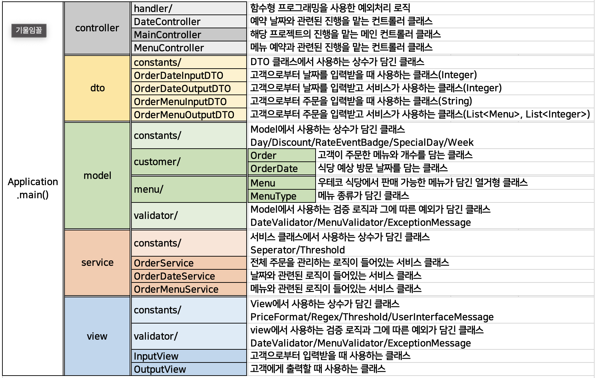

# 🎄4주차 크리스마스 프로모션 🎄

## 프로젝트 구조



## 📚 고민의 흔적

✏️ 01. ```Controller-DTO-Service-Model 관계를 고민하며 설계하자.```

- 3주 차 미션까지는 MVC의 개념을 적용시키자고 생각을 했었는데, 
    Service라는 개념에 대해 알게 되어 찾아보니 Service를 DTO와 같이 사용하는 것을 볼 수 있었습니다. 
- Service와 DTO를 사용하면 Model과 View의 강한 결합을 막아 주고 불필요한 데이터를 전송하지 않게 된다는 사실에 
    4주 차 미션에 적용을 시켜보고 싶었습니다.
- DTO는 record로 구현을 하면 편리하게 구현이 가능하다고 하기에 record라는 클래스를 활용 했습니다.


✏️ 02. ```규칙의 종류에는 입력 유효성 검증과 비즈니스 규칙이 있다.```

- ```입력 유효성 검증```은 Model에 접근하지 않고 검증하는 것을 말합니다. 
  - 예: ```송금 금액은 0보다 크다```
- ```비즈니스 규칙```은 Model의 현재 상태를 알아야 가능한 검증입니다. 
  - 예: ```송금 금액은 초과 출금이 불가하다```
- 입력과 동시에 검증이 가능한 부분은 View에서 검증을 하고, 객체 자체의 값을 보고 검증해야 하는 부분은 따로 정의하여 Service나 Model에서 할 수 있도록 나누었습니다.
- View에서 검증을 하는 방법으로 정규 표현식을 사용합니다.
  - 해당 미션 요구사항 중 하나가 '메뉴 이름-0'이라는 입력을 하면 0개의 주문은 성립되지 않아 예외 처리가 됩니다. 
  - 정규 표현식을 사용하니 입력 부분에서 판단이 가능하여 0이라는 숫자가 들어왔을 때 바로 예외 처리를 할 수 있는데, 이는 '```주문이라는 객체```의 개수의 값이므로 Model에서 판단을 해줘야 하는 것이 아닌가?'라는 생각이 들었습니다. 
  - 하지만 정규 표현식으로 입력에서 걸러준다면 실행 시간도 아끼고, 굳이 Model을 거치지 않아도 검증할 수 있으므로 ```View에서 검증```하는 것으로 구현했습니다.


✏️ 03. ```컨트롤러를 Model 별로 만들어 필요할 때 활용하라.```

- 메인 컨트롤러를 제외하고 제가 생각했던 Model인 예약 날짜와 주문 건에 대한 컨트롤러 2가지를 더 만들었습니다.
- 컨트롤러는 입력이 들어왔을 때 입력 값이 선택되는 과정에서 분기될 때 그 능력을 발휘할 것이라고 생각합니다. 
  
  그런데 미션은 입력이 곧 순서가 되다 보니 컨트롤러를 나누고 각각 다른 Service를 만들어 주는 과정에서 역할 분할을 제대로 하지 못했습니다. 
  
  그래서 결과를 봤을 때 거의 메인 컨트롤러에서 구현을 해 버려 이럴 것 같으면 컨트롤러를 나눠둔 의미가 없겠다고 느꼈습니다. 
- 후에 다시 리팩토링할 때는 역할에 대해 좀 더 고민해 보고 구현해야겠다는 생각이 듭니다.

✏️ 04. ```열거형 클래스를 어떻게 사용할 수 있을까?```

- Menu는 애피타이저/메인 요리/디저트/음료들의 메뉴 각각을 담고 있는 enum을 만들고, 그 enum 리스트를 가지고 있는 MenuType이라는 클래스를 만들고 싶었습니다. 
  
  하지만 아직 enum에 대한 지식이 많이 부족해 하나의 열거형 클래스에 메뉴 종류를 두고 MenuType은 다른 static 클래스로 만드는 것으로 구현 했습니다.


# 🎄 기능 요구 사항 🎄

## 핵심 기능
고객이 주문할 메뉴와 개수를 알려주면 날짜와 대조해 총 혜택 금액을 반환한다.

## 우테코 식당 메뉴
```
<애피타이저>
양송이수프(6,000), 타파스(5,500), 시저샐러드(8,000)

<메인>
티본스테이크(55,000), 바비큐립(54,000), 해산물파스타(35,000), 크리스마스파스타(25,000)

<디저트>
초코케이크(15,000), 아이스크림(5,000)

<음료>
제로콜라(3,000), 레드와인(60,000), 샴페인(25,000)
```

# 이벤트
- 총 주문 10,000원 이상부터 적용한다.
- 음료만 주문 시, 주문할 수 없다.
- 메뉴는 한 번에 최대 20개까지만 주문할 수 있다.
    - 이 때 최대 개수란, 모든 메뉴 구매 개수를 합한 개수이다.

## 1. 할인

- 크리스마스 디데이 할인
  - 23.12.1 ~ 23.12.25
  - 1000원으로 시작하여 날마다 할인 금액이 100원씩 증가 <br>
    :1000원 + (날짜-1)*100
  - 총 주문 금액에서 해당 금액만큼 할인된다.

- 평일 할인
    - 일요일~목요일
    - 디저트 메뉴를 메뉴 1개당 2,023원 할인한다.

- 주말 할인
    - 금요일, 토요일
    - 메인 메뉴를 메뉴 1개당 2,023원 할인한다.

- 특별 할인
    - 이벤트 달력에 별이 있는 날(매주 일요일과 25일)
    - 총 주문 금액에서 1,000원 할인한다.

## 2. 증정 이벤트
- 할인 전 총 주문 금액이 12만원 이상일 때, 샴페인 1개를 증정한다.
- 샴페인의 가격은 25,000원이다.

## 3. 이벤트 배지
- 총 혜택 금액에 따라 이벤트 배지를 부여한다.
    - 5,000원 이상: 별
    - 1만원 이상: 트리
    - 2만원 이상: 산타


---

# 입력 요구 사항
- 예상 방문 날짜를 입력 받는다.
- 주문할 메뉴와 메뉴 개수를 입력 받는다.
    - 메뉴 개수는 총 20개만 주문 가능하다.
    - 입력 포맷은 다음과 같다.
        - ```메뉴-/d,메뉴-/d ... 반복```
        - 예시
            - ```타파스-1,제로콜라-1```
            - ```티본스테이크-1,바비큐립-1,초코케이크-2,제로콜라-1```


## 나타날 수 있는 예외

1. 예상 방문 날짜를 입력하며 예외 발생시 다음과 같은 메시지를 출력한다.

   ```[ERROR] 유효하지 않은 날짜입니다. 다시 입력해 주세요.```
    - 나타날 수 있는 예외는 다음과 같다.
        - 1 이상 31 이하의 숫자가 아닌 경우
        - 문자를 입력한 경우


2. 주문할 메뉴와 메뉴 개수를 입력하며 예외 발생시 다음과 같은 메시지를 출력한다.

   ```[ERROR] 유효하지 않은 주문입니다. 다시 입력해 주세요.```
    - 나타날 수 있는 예외는 다음과 같다.
        - 메뉴판에 없는 메뉴를 입력하는 경우
        - 메뉴의 개수가 1 이상의 숫자가 아닌 경우
        - 메뉴 형식이 예시와 다른 경우
        - 중복 메뉴를 입력한 경우 ```(e.g. 시저샐러드-1,시저샐러드-1)```
        - 메뉴의 개수가 총 7 이상의 숫자일 경우
        - 음료만 주문한 경우

---

# 출력 요구 사항
- 금액의 출력 포맷은 다음과 같다.
    - ```#,###원```
    - 예시
        - 양수: ```8,500원, 142,000원```
        - 음수: ```-1,200원, -25,000원```

---
- 고객이 식당을 방문할 날짜를 출력한다.
- 고객이 주문할 메뉴를 출력한다.
- 할인 전 총 주문 금액을 출력한다.
- 증정 메뉴를 출력한다.
    - 없을시 '```없음```'을 출력한다.
- 혜택 내역을 출력한다.
    - 고객에게 적용된 이벤트 내역만을 보여준다.
    - 여러 개의 이벤트가 적용될 수 있고, 출력 순서는 자유이다.
    - 없을시 '```없음```'을 출력한다.
- 총 혜택 금액을 출력한다.
    - 할인 금액의 합계 + 증정 메뉴(샴페인)의 가격 <br>
      = 할인금액 + 25,000원
    - 없을시 '```0원```'을 출력한다.
- 할인 후 예상 결제 금액을 출력한다.
    - 할인 전 총 주문 금액 - 할인 금액
- 12월 이벤트 배지를 출력한다.
